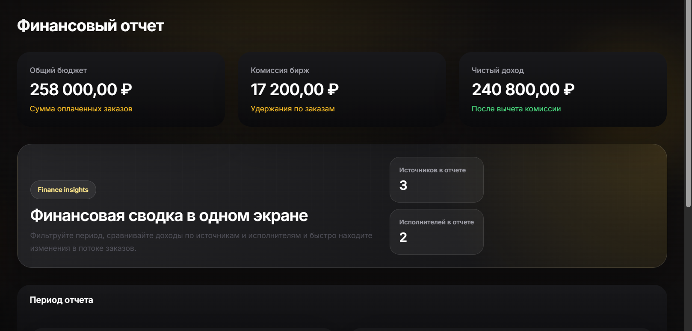
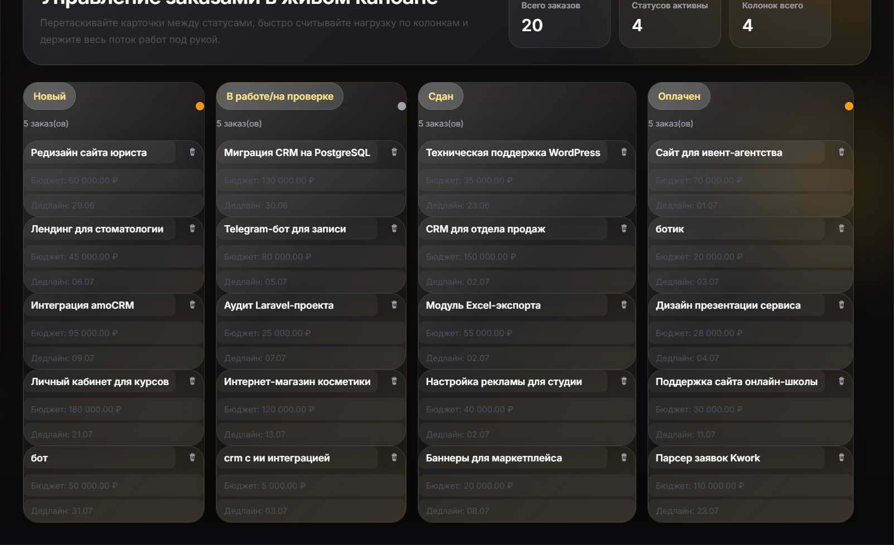

# 🚀 Freelance CRM

Современная система управления заказами и финансовой аналитики, построенная на стеке Laravel 13, Filament v3 и Tailwind CSS 4.



## ✨ Основные возможности

*   **📊 Интеллектуальный Дашборд:** Мгновенный обзор ключевых финансовых показателей: общая выручка, комиссии и чистая прибыль.
*   **📋 Продвинутый Kanban:** Гибкое управление заказами через drag-and-drop интерфейс. Визуальное отслеживание статусов и финансовых параметров каждой сделки.
*   **💰 Финансовый контроль:** Автоматический расчет прибыли, учет комиссий различных платформ и глубокая аналитика по исполнителям и источникам.
*   **🔀 Hybrid DB Mode:** Уникальная поддержка работы в гибридном режиме. Используйте SQLite локально и синхронизируйте данные с основной PostgreSQL базой одной командой:
    ```bash
    php artisan app:sync-remote-database
    ```
*   **🔔 Уведомления в Telegram:** Оперативное информирование о важных событиях в системе.
*   **🛡️ Безопасность:** Тонкая настройка прав доступа с помощью Filament Shield и интеграция ролей Spatie.

## 🛠️ Технологический стек

*   **Core:** PHP 8.3 + Laravel 13.8
*   **UI Framework:** Filament v3 (TALL Stack)
*   **Frontend:** Tailwind CSS 4 + Vite 8
*   **Database:** PostgreSQL / SQLite
*   **Analytics:** Интеграция с Excel (Maatwebsite)

## 📦 Установка

1.  **Клонируйте репозиторий:**
    ```bash
    git clone https://github.com/your-repo/project.git
    cd project
    ```

2.  **Запустите скрипт автоматической настройки:**
    Мы подготовили удобную команду для полной инициализации проекта:
    ```bash
    composer setup
    ```
    *Эта команда установит зависимости, сгенерирует ключи, настроит базу данных и соберет фронтенд.*

3.  **Настройте окружение:**
    Отредактируйте `.env` файл, указав параметры подключения к базе данных и настройки Telegram бота.

4.  **Запуск:**
    ```bash
    php artisan serve
    ```

## 📋 Работа с Kanban-доской



Канбан-доска является центральным узлом управления заказами:

*   **Создание заказа:** Нажмите кнопку "Создать" прямо в интерфейсе доски для быстрого добавления новой сделки.
*   **Управление статусом:** Просто перетащите карточку заказа между колонками («Новый», «В работе», «Завершен») для обновления его состояния.
*   **Финансовые индикаторы:** В каждой карточке отображается бюджет и комиссия. Цветные индикаторы помогут мгновенно оценить прибыльность заказа.
*   **Ролевой доступ:** Видимость финансовых данных (бюджета и прибыли) динамически меняется в зависимости от прав пользователя.

## 📈 Финансовая отчетность

Раздел "Финансовый отчет" предоставляет детализированную сводку:
- Фильтрация по периодам.
- Сравнение доходов по источникам заказов.
- Аналитика эффективности исполнителей.

## 📄 Лицензия

Данное программное обеспечение распространяется под лицензией **MIT**. Подробности в файле [LICENSE](LICENSE).
